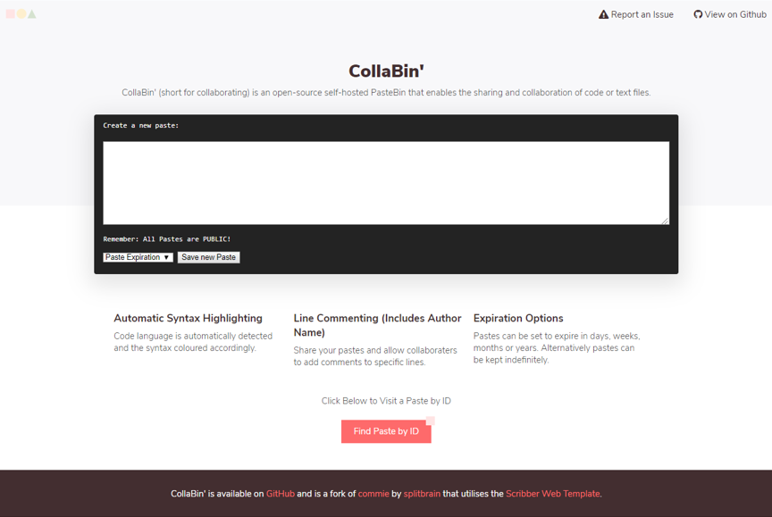
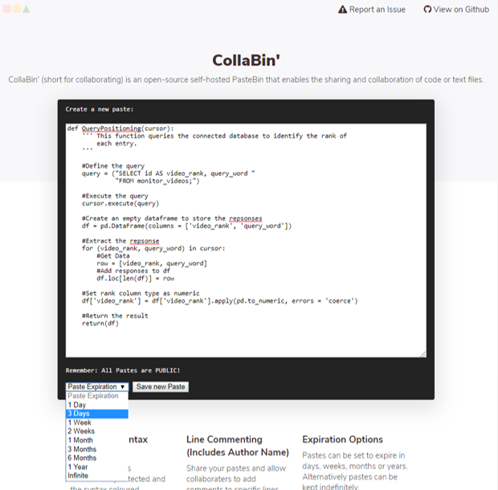
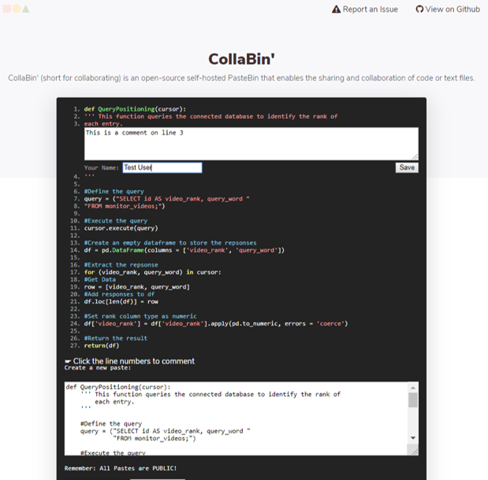
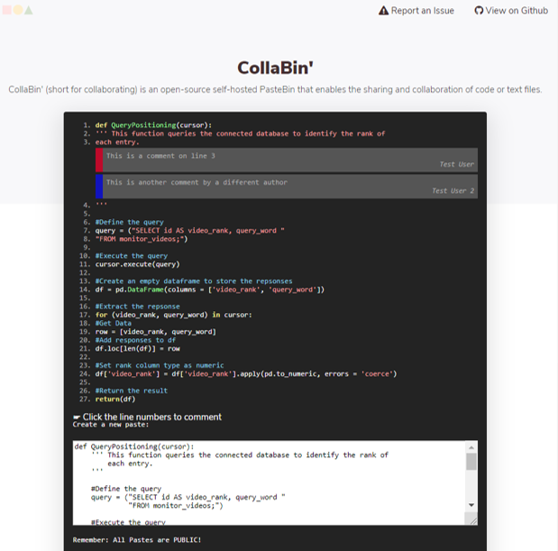

# CollaBin

CollaBin' (short for collaborating) is an open-source self-hosted PasteBin that enables the sharing and collaboration of code or text files.

* Automatic Syntax Highlighting
* Line Commenting (Includes Author Name)
* Range of Expiry Date Options

## Live Demo
 Use CollaBin' at https://collaboratewith.danielhammocks.uk
 
 ## Usage
 
 ### Creating a Paste
 

 
 ### Adding a Comment
 

 ### Viewing Comments
 

 
 

## Installation
To install, clone this Git somewhere under your webroot (PHP required) and make the data directory writable.

## Roots
CollaBin' is a fork of commie by splitbrain.
CollaBin's responsive web design is based on Scribbler by Amie Chen.
